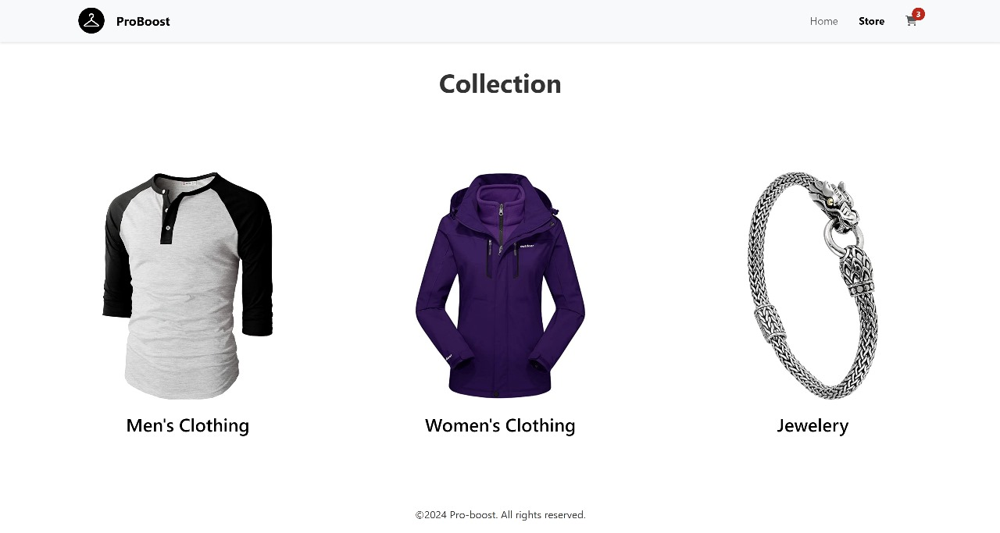

# 🛒 Shopping Cart Application

## 📘 Project Overview

**Shopping Cart Application** is a modern, responsive e-commerce platform designed to provide users with a seamless shopping experience. Built with contemporary web technologies, it offers a user-friendly interface and efficient cart management features.

## 🚀 Features

- **Responsive Design**: Ensures optimal viewing across various devices.
- **Dynamic Cart Management**: Add, remove, and update items in the cart with real-time feedback.
- **Product Listings**: Display products with images, descriptions, and prices.
- **User Authentication**: Secure login and registration functionalities.
- **Order Summary**: Provides a detailed overview of selected products and total cost.

## ❤️ Demo



This screenshot showcases the store page, highlighting the three main categories and the cart icon in the navigation bar, with some products added to the cart.

## 🧱 Project Structure

```
Shoping-cart/
├── public/                 # Static assets (images, icons)
├── src/
│   ├── components/         # Reusable UI components
│   ├── pages/              # Page components (Home, Cart, etc.)
│   ├── styles/             # CSS stylesheets
│   └── utils/              # Utility functions
├── index.html              # Main HTML file
├── package.json            # Project metadata and dependencies
├── README.md               # Project documentation
└── .gitignore              # Git ignore file
```

## ⚙️ Tech Stack

- HTML5
- CSS3
- JavaScript (ES6+)

## 🛠 Installation & Setup

### Prerequisites

- [Node.js](https://nodejs.org/) (v14 or higher)
- [npm](https://www.npmjs.com/)

### Steps

1. **Clone the Repository**

   ```bash
   git clone https://github.com/pro-boost/Shoping-cart.git
   cd Shoping-cart
   ```

2. **Install Dependencies**

   ```bash
   npm install
   ```

3. **Start the Development Server**

   ```bash
   npm start
   ```

4. **Build for Production**

   ```bash
   npm run build
   ```

## 🌐 Deployment

After building the project, the static files will be located in the `dist/` directory. You can deploy these files to any static hosting service like [Netlify](https://www.netlify.com/), [Vercel](https://vercel.com/), or [GitHub Pages](https://pages.github.com/).

## 📄 License

This project is open-source and available under the [MIT License](LICENSE).

## 🤝 Contributing

Contributions are welcome! Please fork the repository and submit a pull request for any enhancements or bug fixes.

---

Made by [pro-boost](https://github.com/pro-boost)


